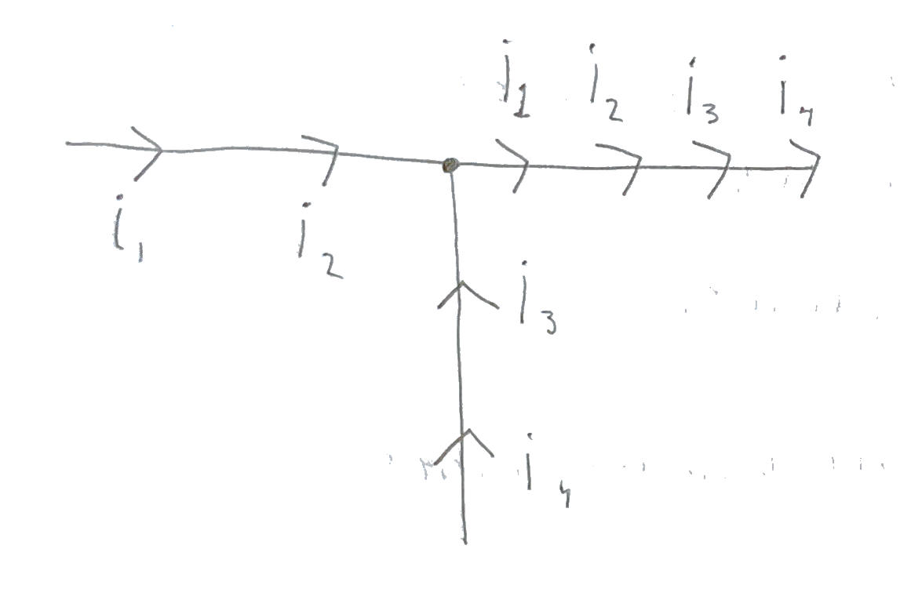
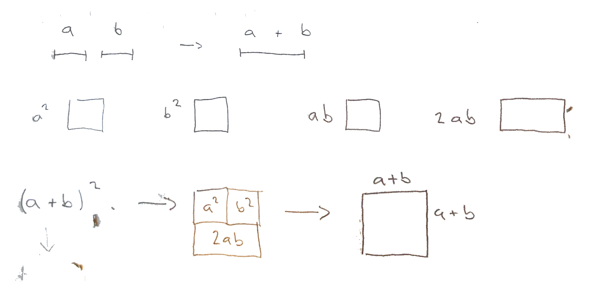
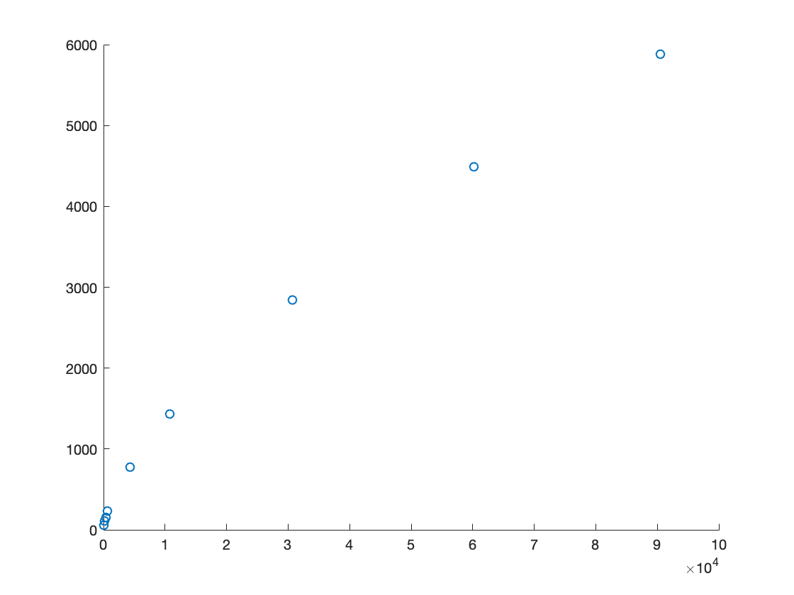
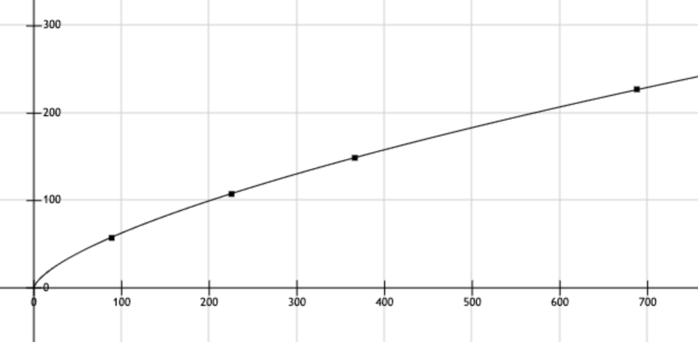
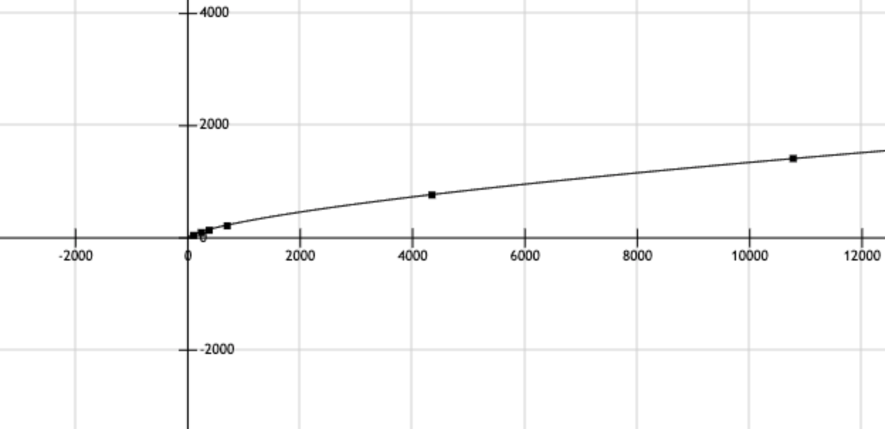
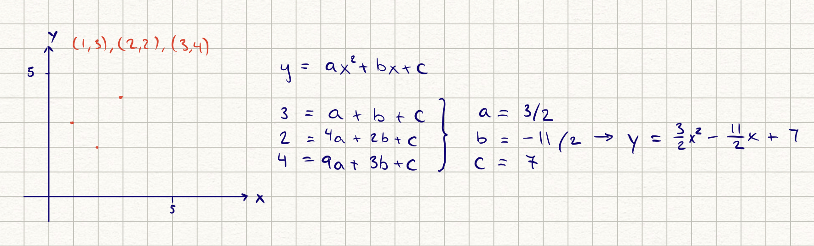
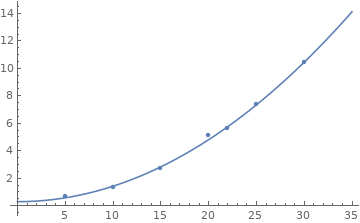
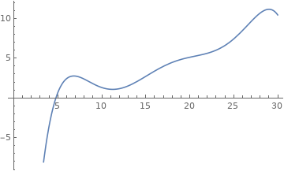
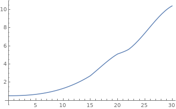

# Problem Module lv1
## 1. Formulas Problem
- How do we know it's reasonable? 
- How well can it be expected to fit with reality? (exact or aprox)

* Pythagoras theorem: $a^2+b^2=c^2$

  - Pytharogas theorem gets me thinking about distance between objects
  - If either $a$ or $b$ is $0$, we end up with $a^2 = c^2$ (the same line are equal lengths) which we know to be true. 
  - If we sum the quadrat of both cathetus $3^2+4^2=5^2$

* Stock index = $2045 +0.0034t$
  - since this is made up index we don't bother about the $2045$ or $0.0034$. What we know is that it is an approximation because we cannot predict the future. There's one unrealistic part of the equation. A stock index cannot be linear since a percental increase every year results in a exponetial curve.
* Population = $C*a^t$ where $t =$ time in years
  - This is also an approximation since we're trying to predict the future.
  - It is realistic since it's an exponential equation and population has a percental increase every year. 
* Gravity between bodies: $F = \frac{Gm_1m_2}{r^2}$
  - What this equation is telling us is that when distance increases ($r^2$), $F$ decreases, when $m_1$ or $m_2$ increases, $F$ increases. It seems realistic that the force between objects should decrease when the distance between them increases. It also seems right that the force between objects should increase as the mass increases. We can only assume that it is exact since it's based on experiements by experienced proffessors and backed up by a science community.
* Newton's force: $F=ma$
    - This is an equation with existing measurable parameters that exists in time and space. Therefore we can assume it's exact. Reasonably the $F$ should increase as both mass ($m$) and acceleration ($a$) increases. Considering the example of me pushing something. If I want it to accelerate, it's going need more force applied if it's heavier. 
* Parcel max size: $100*weight+length < 320$
  - We know the equation is reasonable as a parcel has a measurable weight and a length. The constant multiplier also seems reasonable as we then exclude something with extreme low weigth and then large length.
  - It's an exact equation as the parameters are measurable.   
  - This is a linear equation.
* presentStudents + absentStudents = allStudents
  - We know this is true as students can only exist in two states, present or absent. The sum of these are all students.
  - It's an exact equation as we can count the number in each group.
* Electric current: $I_1 + I_2 + I_3 = 0$ in a circuit knot
    - This feels reasonable as we assume current are preserved and that the input are constants. Since the current entering is positive and the current leaving is negative and we know that the parameters are constant. The sum of all current will be equal to zero.
    - 
    - An exact equation as long as we assume that it's preserved
* Insurance rebate in percentage $=\text{insurances}*2 + 0.2*min(7, \text{years customer)}$
    - Given the standard case with one insurance and 7 as a multiplier we get $3.4$% rebate. As the description says, a good customer should get a lower rate. But a one year customer gets a lower rate than a 30 year old customer according to this equation, which seems wrong.
    - It's an exact equation as we're working with measurable parameters.
    - Linear equation
* $(a+b)^2=a^2+2ab+b^2$
  - This is realistic with this image as proof and if one or both of the parameters are zero. The corresponding expression remains true.
  - 
  - It's an exact equation as parameters are measurable
  - this is a quadratic equation
* $A>=0.8L*I$ (dimensioning requirement for 12V cables if you have a current $I[A]$, cable length $L[m]$ and cable area $A[mm^2]$
  - It's reasonable that we need more cable area if length of the cable increases. It's also reasonable that we need a thicker cable if current increases and therfore more cable area.
  - We feels it's more of an apporximation than an exact equation because to get the area of a cylinder, we would need to involve $π$. $0.8$ is an approximation.
  - This equation is linear because we have two unknown
* air drag force $= C* v^2 * A$
  - it's reasonable that drag increases as both velocity and cross section area increases. The same as feeling more air force drag with hand opened than closed. It's also reasonable that we would need a constant as shape of the object has an inpact on the air force drag. 
  - This seems like an approximate equation as the equation is very simple and a calculation like this should be more advanced. Especially considering the shape of the object.
  - this is a quadratic equation.
* $weight = C* length^3$  (the constant C should be chosen depending on type of object e.g. persons, dogs, cars)
  - Feels like a weak estimate of a weigth. Especially considering the constant $C$. For example. compare a chihuahua and a pug. THey are both the same length but obviously not the same weight.
  - Since the length is cubed, the weigth will have a large variance for change in length.
* $P[\text{getting heads when tossing a coin}] = 1/2$
  - This we know to be true as long it is a fair coin. It has two sides with equal chance of getting chosen. Since we're dealing with probability, testing this out would probably not result in a 50/50 result. But as sample size increases we would get closes to $1/2$.

## 2 
Plotting the points in a graph we get: 

- By looking at the data in the plot we noticed that a linear equation would not do. By regonizing the patterns of the data plots we tried plotting functions on the form $y = C * x ^ a$
- We noticed that the functions we tested followed the data points rather well. So we created an equation system using distance as the value $y$ and time as the value for $x$ and solved it for $C$ and $a$. 
- $C$ resulted in 2.94136 and $a$ resulted in 0.665185.
- By plotting the function $y = 2.94136* x^{0.665185}$ with the data points we can see that the model is highly accurate.

- The deviations from the known entries are small when using the model and since the data is not that proportional the deviation can be justified. Getting the distance from only the parameter time will lead to some deviation.
- We are confident that model could calculate the distance given other values of T that are not in the table. There would still be a deviation in accuracy espically when the t increases.  

## 3
We're thinking that the period should only be affected by length of the rope $L$ and the acceleration which is gravity in this case $g$. It is not affected by drop angle because a larger drop angle would give it more speed but more distance to cover, in comparison with a small drop angle which has a low speed but also less distance to cover. Reasonably then time $T$ is an expression dependent on $L$ and $g$. The mass is also a parameter that doesn't affect the period as a large mass gives it more speed on the way down but then also slows it down more on the way up. This can also be backed up by this equation.
$$
\text{We know that } F=mg \text{ and that } F=\frac{mL}{T^2}.
$$
$$
\text{Setting these equal to each other we get: } mg=\frac{mL}{T^2}
$$
$$
\text{Resulting in: } g=\frac{L}{T^2}
$$
$g$ is only affected by length $L$ and time $T$. This results in the expression for $T$
$$
T^2=\frac{L}{g}=>T=\sqrt{\frac{L}{g}}
$$
If we do a dimensional analysis of this we know that $g$ is in the unit form $m/s^2$ and that $L$ is $m$. This means that we get $T=\sqrt{\frac{m}{m/s^2}}$. Cross out the $m$ and we get $T=\sqrt{s^2}=s$.

Let's try an experiment. Dropping with a line length $1$ we get that
$$
T=\sqrt{\frac{1}{9.82}} = 0.32\text{ seconds.} 
$$
Then we tried with a physical pendulum and got the time $2.6$ seconds.

Let's try another one, this time with $L=0.5$
$$
T=\sqrt{\frac{0.5}{9.82}}=0.23 \text{ seconds}
$$
testing this again with a physical pendulum we got 1.83 seconds. To get this right we need a constant.
$$
T=C*\sqrt{\frac{L}{g}}
$$
$$
2.6=C*\sqrt{\frac{1}{9.82}} \text{ and } 1.83=C*\sqrt{\frac{0.5}{9.82}}
$$
For the first equation we get $C=8.15$ and the second we get $C=8.11$. This gives us this approxiamte equation
$$
T=8*\sqrt{\frac{L}{g}}
$$
## 4
### a)

With a simple equation system we get an equation that fits the points. But when adding $(4,5)$ we see that it doesn't fit the curve of the function anymore. We would have to redo all the work and create another equation. This would have to be done for all new points pivoting from the function curve. 
### Least squares method
The least squares method takes the error from each points in relation to the line, squares each error and then adds them all together. The "error" in this case is each point's $y$-distance from the linear approximation.

The least square method is only useful when we have more data points than parameters, that is, when we have a overdetermined system because it gives an approximation to a system that rarely has a solution. When the data points are too incosistent and more than the parameters, we get this overdetermined system that has to be approximated to be described. If the case were that we had fewer data points than parameters, the system becomes under constraint and we would have an infinite number of solutions to describe it. Therefore making an approximation using the least squares method meaningless. 

The Mathematica Fit function finds the line that best fits the data.
### b)
To fit the points we use the formula for $\hat{Y}=\beta_0+\beta_1x$
$$
\beta_1 = \frac{n\sum_{}^{n}xy - \sum_{}^{n}x\sum_{}^{n}y}{n\sum_{}^{n}x^2 - (\sum_{}^{n}x)^2}
$$
$$
\beta_0 = \bar{Y}-\beta_1\bar{x}
$$
This gives us the values $\beta_1=0.39$ and $\beta_0=-2.34$.

We believe the quality of the model is acceptable considering the approximation is done with a linear equation. We know that this is a good way to get a good linear approximation. However because it's linear there can be large deviations.

We start by plotting the points in a coordinate system. Instantly we feel that a quadratic equation would fit these points better. To find this equation we use mathematica Fit function and get the result $0.28612-0.000305635 x+0.0113034x^2$. We can motivate that this approximation fits better than the linear .with the least squares method. We see that the least squares sum for a quadradic equation is less than for a linear. 

As the image shows, a quadratic fit is much better than a linear fit.

Since the data is somewhat inconsistent between two points, it's hard to find a function that fits all points exactly. However, our model does a pretty good job. Because most points in the table are consistent with our model, we can assume that it also is reliable for new points with small deviations. Conclusion is that there is a correlation between speed and breaking distance on a bicycle and that it is exponential.
## 5
### a)
Because we have seven data points we will reasonably need 7 unknown variables like $y=ax^6+bx^5+cx^4+dx^3+ex^2+fx+g$ and therefore an equation with degree 6. When we the try this in mathematica with the function Fit we get the equation 
$$
-80.371+39.4161 x-7.19884x^2+0.64613x^3-0.0304009x^4+0.000720529x^5-6.77965*10^{-6}x^6
$$

### b)
The result looks like this. 

The idea of spline interpolation is to describe the data sets with concattenated functions. If some points in the dataset could be described by a simple low order function but some points after these points cannot, the idea is to create to spererate functions that bridges the gap of inconsistensy that is between the two data sets, creating an smooth curve that can describe all these datapoints. 

Since spline interpolation can create diffrent functions between data points, the functions used would be of a lower order than if we were to describe them with a single polynomial serie. The resulting curve will also be smoother than if a polynomial series of a highorder was used. It also seems it is better for evaluting values not in the table entries.

### c)
Two situations: Many accurate data points, few low quality data points.

We first consider the situation with many accurate data points. If we use exact curve fitting we will get a very advanced function of a really high order. If we use least squares method we will get an approximation which would deviate more but more accurately describe data points that are outside the table. If the data quality is high and the use of the data is of great importance it seems reasonable to prioritize accuracy (splining) more than approximation (least squares). However, if the data points are of low quality, an approximation seems more justified as long as there is some consistency within the data.

If we have fewer data points it is not as obvious which is better. Let's consider the situation with three data points. If the points are in a triangle a linear approximaton would have a large deviation and tell very little about any possible pattern. Here, exact curve fitting could tell more about missing data. 
## 6
### a)
The level of surprise is going to start from "not surprised at all" to an extreme level of surprise. The function should reasonably return $0$ in the event of "not surprised" level from an event that is 100% chance of happening. Example: $P[\text{getting heads or tails when flipping a coin}]$. However we believe that it doesn't exist a maximum level of surprise with the pholosphy "one could always be more surprised". 

The function for surprise should return a high value for a low input, something that is unlikely should lead to a bigger surprise. We first believed that the relation should be linear, that only the unlikelyness determines the surprise in a linear relation. However there are a lot of factors making us belive that the function should not be linear. Given the example that something unlikely happens to you and that we would expect a big surprise, that dosent say that this unlikely event haven't happened to you many times before. Therefor the surprise might not be as high as one might think.

### b)
Considering the past example that there are a lot of factors that come in play, we don't belive that the surprise level should be the sum of two unrelated events, the equation is more complex. We believe that two unrelated events would increse the level of surprise exponentially. Since the possibility of them happening simuntainusely also gives a surprise factor. 

The model describing this would contain a factor for events happening simentainusely, a factor for how many times the individual event has happen to the person before and that the lower probaibility for an event would return a higher surprise. 
$$
P[\text{surprise}] = \frac{1}{\prod^n_{i=0} {P[event]}*\text{number of times it has happened}}
$$

