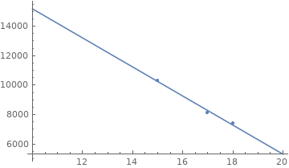

# Problem Module lv1
## General info
* FIRE group number 75
* module number 2
* By
  - Oskar Wallgren, 960107-2292, IT, oskarwallgren@icloud.com
  - Hugo Cliffordson, 970917-5799, IT, cliffords.contact@gmail.com

* "We hereby declare that we have both actively participated in solving every exercise. All solutions are entirely our own work, without having taken part of other solutions.
* Number of hours spent for each one of you
  - We haven't tracked time but we have only worked simultaneously and approximately Xh this week
* Number of hours spent in supervision for this module
  - Xh

## 1. Chocolate Factory Problem
### Known parameters
- Current production: **80'000 bars/year**
- Annual Revenue: **1.3 Mkr**
- Marginal loss last year: **40'000 kr**
- New machine cost: **450'000 kr**
    * Improvements: reduce production cost form 5 to 3 kr/bar
#### City trend sales
| year 	| quantity 	| unit price 	|
|------	|----------	|------------	|
| 2014 	| 10300    	|    15 kr   	|
| 2015 	| 8100     	|    17 kr   	|
| 2016 	| 7400     	|    18 kr   	|

To get a better understanding we start off by calculating revenue each year. 

$2014 = 10300*15 = 154500$

$2015 = 8100*17 = 137 700$

$2016 = 7400*18 = 133 200$

We can conclude that also the total revenue has a downward trend. We can also calculate fixed costs for production. 

$\text{production cost} = quantity*cost$

$2014: 10300*5=51500$

2015: $8100*5=40500$

2016: $7400*5=37000$

First figure illustrates the correlation between quantity and unit price. Here we can see that sold quantity increases as we lower prices.

The next figure illustrates the correlation between unit price and revenue (unit price $*$ quantity sold). Here we can see that the most revenue measured is when we have a unit price of $15kr$. 

Since we only have these three data points from a sample in their hometown, we dont think that this is enough to create a justified model to caluclate the optimal unit price to maximize revenue. However, we know that the maximum revenue they had, in their home town, was at $15$ SEK/unit. We believe that this is sufficient information to conclude that the unit price should be $15$ SEK in order to maxmize the revenue based on the data we have.

From the numbers given in the question we know the total revenue to be $1.3Mkr$, the marginal loss to be $40 000$kr. By this we draw the conclusion that total costs equals to $1'340'000$kr. We know that out of this, production cost equals $5*80000=400'000$. This means that we can calculate fixed costs to be $940'000$kr.

To calculate whether it is worth investing in a new machine or not, we have to calculate how much money is saved each year on production. We know that we save $2kr/bar$ in production, this results in saving total of $2*80'000kr=160'000kr/year$. We also know the current loss to be $40'000kr$. The new machine would therefore change $40'000kr$ marginal loss to a $120'000kr$ profit each year.
By this calculation, them machine could be pay itself after $\frac{450'000}{120'000}=3.75$ years.

Our conclution is that we recommend investing in the machine and lowering the unit price to $15$kr/bar.

## 2. Emergency Care Problem
#### Distance in minutes between regions and potential sites / Cost for locating emergency care on respective site

| Site #    | 1 | 2 | 3 | 4 | 5 | 6 |       |       | Cost  |
|---------- |---|---|---|---|---|---|------ |------ |------ |
| Region 1  | 15| 3 | 12| 5 | 17| 20|   X   |Site 1 |710 000|
| Region 2  |12 |9  |13 |16 |3  |4  |   X   |Site 2 |610 000|
| Region 3  |13 |16 |9  |4  |7  |11 |   X   |Site 3 |650 000|
| Region 4  |3  |22 |12 |5  |16 |18 |   X   |Site 4 |910 000|
| Region 5  |4  |7  |6  |22 |5  |14 |   X   |Site 5 |720 000|
| Region 6  |8  |10 |5  |16 |13 |5  |   X   |Site 6 |570 000|
| Region 7  |13 |10 |5  |6  |13 |21 |   X   |       |       |

### a) Model problem mathematically

## 3. Communications Network Problem

### a)

### b)

### c)

## 4. Shortest Path as LP Problem

## 5. Bridge Problem
### a) What will be the travel time during rush hours?

### b) What will be the new travel time between the large cities?