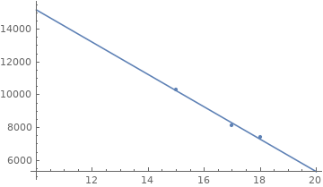
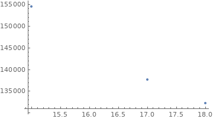
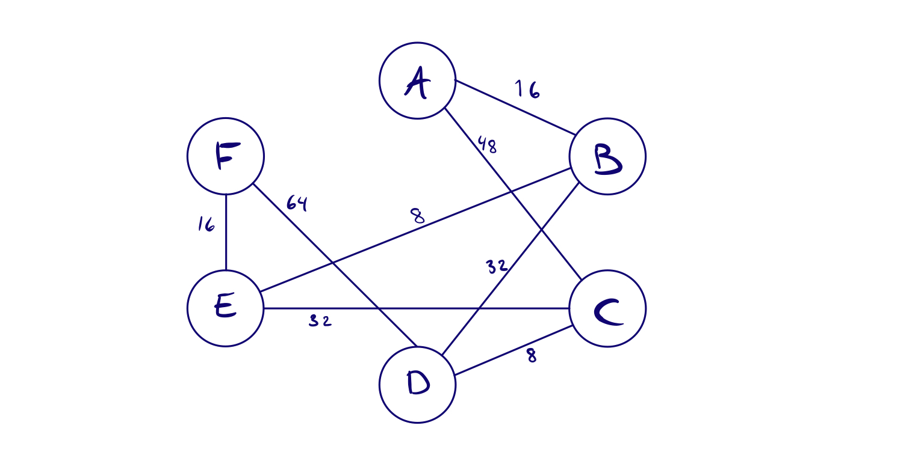
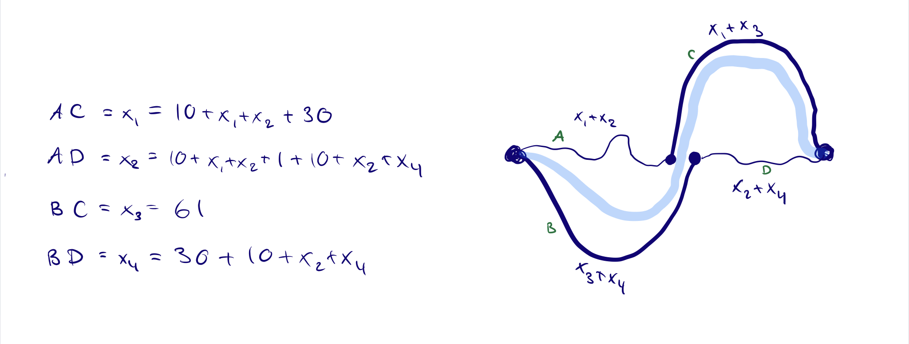

# Problem Module lv1
## General info
* FIRE group number 75
* module number 2
* By
  - Oskar Wallgren, 960107-2292, IT, oskarwallgren@icloud.com
  - Hugo Cliffordson, 970917-5799, IT, cliffords.contact@gmail.com

* "We hereby declare that we have both actively participated in solving every exercise. All solutions are entirely our own work, without having taken part of other solutions.
* Number of hours spent for each one of you
  - Both 12
* Number of hours spent in supervision for this module
  - 4h

## 1. Chocolate Factory Problem
### Known parameters
- Current production: **80'000 bars/year**
- Annual Revenue: **1.3 Mkr**
- Marginal loss last year: **40'000 kr**
- New machine cost: **450'000 kr**
    * Improvements: reduce production cost form 5 to 3 kr/bar
#### City trend sales
| year 	| quantity 	| unit price 	|
|------	|----------	|------------	|
| 2014 	| 10300    	|    15 kr   	|
| 2015 	| 8100     	|    17 kr   	|
| 2016 	| 7400     	|    18 kr   	|

To get a better understanding we start off by calculating revenue each year. 

$2014 = 10300*15 = 154500$

$2015 = 8100*17 = 137 700$

$2016 = 7400*18 = 133 200$

We can conclude that also the total revenue has a downward trend. We can also calculate fixed costs for production. 

$\text{production cost} = quantity*cost$

$2014: 10300*5=51500$

2015: $8100*5=40500$

2016: $7400*5=37000$

First figure illustrates the correlation between quantity and unit price. Here we can see that sold quantity increases as we lower prices.

The next figure illustrates the correlation between unit price and revenue (unit price $*$ quantity sold). Here we can see that the most revenue measured is when we have a unit price of $15kr$. 

Since we only have these three data points from a sample from their hometown, we dont think that it is enough to create a justified model to caluclate the optimal unit price to maximize revenue. However, we know that the maximum revenue they had, in their home town, was at $15$ SEK/unit. We believe that this is sufficient information to conclude that the unit price should be $15$ SEK in order to maxmize the revenue based on the data we have.

From the numbers given in the question we know the total revenue to be $1.3Mkr$, the marginal loss to be $40 000$kr. By this we draw the conclusion that total costs equals to $1'340'000$kr. We know that out of this, production cost equals $5*80000=400'000$. This means that we can calculate fixed costs to be $940'000$kr.

To calculate whether it is worth investing in a new machine or not, we have to calculate how much money is saved each year on production. We know that we save $2kr/bar$ in production, this results in saving total of $2*80'000kr=160'000kr/year$. We also know the current loss to be $40'000kr$. The new machine would therefore change $40'000kr$ marginal loss to a $120'000kr$ profit each year.
By this calculation, them machine could be pay itself after $\frac{450'000}{120'000}=3.75$ years.

Our conclution is that we recommend investing in the machine and lowering the unit price to $15$kr/bar.

## 2. Emergency Care Problem
#### Distance in minutes between regions and potential sites / Cost for locating emergency care on respective site

| Site #    | 1 | 2 | 3 | 4 | 5 | 6 |       |       | Cost  |
|---------- |---|---|---|---|---|---|------ |------ |------ |
| Region 1  | 15| 3 | 12| 5 | 17| 20|   X   |Site 1 |710 000|
| Region 2  |12 |9  |13 |16 |3  |4  |   X   |Site 2 |610 000|
| Region 3  |13 |16 |9  |4  |7  |11 |   X   |Site 3 |650 000|
| Region 4  |3  |22 |12 |5  |16 |18 |   X   |Site 4 |910 000|
| Region 5  |4  |7  |6  |22 |5  |14 |   X   |Site 5 |720 000|
| Region 6  |8  |10 |5  |16 |13 |5  |   X   |Site 6 |570 000|
| Region 7  |13 |10 |5  |6  |13 |21 |   X   |       |       |

### a) Model problem mathematically
First we set up variables. What we need for this problem is to cover all regions. We set up each site as a variable: $x_1, x_2, x_3...x_6$. Each site variable is going to be binary. Meaning that it will either be a $1$ or a $0$, depending on if it is to be built or not. We also need the constant for the cost of each site.

To calculate the objective function we need to formulate the problem as to what the minimum cost of building sites to cover all regions. This gives us the objective function 
$$
OF = s_1x_1+s_2x_2+s_3x_3+s_4x_4+s_5x_5+s_6x_6
$$
Since $x_i$ is a binary value, some of there parameters are going to equal zero.
For the objective function we need constraints. The constraints are going to be that *all regions need to be covered by at least one site*: 
$$
x_2+x_4 \ge 1,\\ x_5+x_6 \ge 1,\\ x_4+x_5 \ge 1,\\ x_1+x_4 \ge 1,\\ x_1+x_2+x_3+x_5 \ge 1,\\ x_1+x_3+x_6 \ge 1,\\ x_3+x_4 \ge 1
$$
And that a site is either built or not: $0 \le x_i \le 1$
### b)
The objective function and the constraints we found are linear.
 
### c) Use $NMinimize[]$
We take the variables and our objective function, with its constraints and input it into Mathematica. The result we get is this:
$$
1.752*10^6, x_1=0.2, x_2=0.2, x_3=0.2, x_4=0.8, x_5=0.4, x_6=0.6.
$$
Right away we see that this is not the answer we want as we want whole numbers. If we apply this to the real world we would say that the best optimization for this problem is to build one fifth of a site at some sites and parts of sites in other places. As this feels unrealistic we continue trying to solve it with integers.
### d) Force Integers
When we change our variable to be only $1$ or $0$ we get it to be binary as we wanted from the start. Now we get the result:
$$
2.09*10^6, x_1=0, x_2=1, x_3=0, x_4=1, x_5=0, x_6=1
$$
This tells us that if we want to cover all regions at a minimal cost we should build site $2$, $4$ and $6$ to a total cost of $2'090'000$.
### e) Could we handle it differently?
Another way to think about this problem is to instead of optimizing the cost, optimizing travel minutes. Let's reformulate it like we can build a maximum of two sites. How do we minimize the travel minutes from each Region? To make this problem even more complex we could try to do this in combination. Optimize both travel time and cost.
## 3. Communications Network Problem

### a)
Let's start by setting up variables we need. The task is to route as much communication to $F$ as possible. We want to know which routes we need to do this. Therefore we need variables for each link between the nodes. Each variable is going to represent the capacity. 
$$
AB, AC, BD, BE, CD, CE, DF, EF
$$
Next up we want to find an objective function, max capacity $T$.
$$
T = EF+DF
$$
Representing the maximum capacity into $F$. Constraint we need for this is first each connections capacity.
$$
-16 \le AB \le 16,
{} -48 \le AC \le 48,
{} -32 \le BD \le 32,
{}-8 \le BE \le 8,
{}-8 \le CD \le 8,
{}-32 \le CE \le 32,
{}-64 \le DF \le 64,
{}-16 \le EF \le 16
$$
Next that each node has equal amount coming in as going out.
$$
AB-(BE+BD)=0,
{}AC-(CE+CD) = 0,
{}BD-(CD+DF) = 0,
{}CE-(BE+EF) = 0,
$$
We get this output:
$$
T=48,\text{ }
AB=16,\text{ } AC=0,\text{ }BD=24,\text{ }BE=-8,\text{ }CD=-8,\text{ }CE=8,\text{ }DF=32,\text{ }EF=16
$$
The maximum capacity into $F$ is therefore 48Mbit/s

### b)
If $BD$ breaks, we will have to change our constraint. More specifically we remove the variable $BD$, remove the $-32 \le BD \le 32$ constraint and redo the relation constraints. 
$$
AB - BE = 0,
{}AC - (CE + CD) = 0,
{}CD-DF = 0,
{}CE-(BE+EF) = 0,
$$
This results in
$$
T=24,\text{ }
AC=-8,\text{ }AC=16,\text{ }BE=-8,\text{ }CD=8,\text{ }CD=8,\text{ }DF=8,\text{ }EF=16
$$
The maximum capacity when removing BD is halved from 48 to 24. 

### c)
We modeled this problem in two different ways. First we used the same function and constraints as before, except for an added constraint where $DF+EF=35$. This gave us:
$$
35,AB=16,AC=13,BD=19.,BE=-3.,CD=0,CE=13,DF=19,EF=16.
$$
The connection CD is not required to reach a capacity of 35Mbit/s.
Next we modeled it trying to find the minimum connections needed to get *at least* 35Mbit/s. With new variables:
$x_1, x_2, x_3, x_4, x_5, x_6, x_7, x_8$ representing each connection as binary variables 0 or 1.
To get the capacity we added variables $c_1,c_2...c_8$ representing each connections capacity. With these we want to minimize with the objective function $\sum^8_{i=1}x_i$.
Then we used the constraints to make $x_{1-8}$ binary, $c_{1-8}$ representing capacity and $c_7x_7+c_8x_8\ge35$. This gave us the result:
$$
T=7.,x1->1.,x2->0,x3->1.,x4->1.,x5->1.,x6->1.,x7->1.,x8->1.,c1->3.,c2->-48.,c3->11.,c4->-8.,c5->-8.,c6->8.,c7->19.,c8->16.
$$
Meaning that we don't need connection $x_2$ ($AC$) to get at least 35Mbit/s.

These two answers tells us that it is possible to remove one node entirely. The first model told us that we did not need CD. And our attempt to optimize minimum nodes used with the second model told us that we don't need to use AC. If our models are correct it also tells us that it's only possible to remove one node and still be able to get a capacity of 35Mbit/s.

## 4. Shortest Path as LP Problem
The shortest path can be said to be linear because it can follow the typical expression of a linear programing optimization.
We can:
- minimize an objective function.
- subject it to some constraints 
- with the variables to be determined $\ge 0$
  
If we have a directed graph with $n$ nodes. The shortest path will be the minimum "length/weight" of the edges/arcs needed to get from the Start node to the end node. Assuming one unit of flow enters at start end leaves at the end node. If the graph is unweighted we cannot model it as a linear programming problem.
  
If were interested in finding the shortest path from one node to all other nodes, we could minimize the same objective function but subject it to a constraint that for a edge to be added to the path it cant be in a cycle. Meaning that the edge added cannot be added if by adding it we create a path to a node already visited. By this we will get all the minimum weight of all the edges needed to visit all the nodes except the edges that would result in visiting a node twice. Which would be the shortest path from a node to all other nodes.

#### Variables
$
{X{({}_{from},_{to}})}
$

This variable describes an edge with start in the node *from* and end in the node *to* as a binary value of being either $0$ or $1$. The $0$ meaning that we do not need it in our shortest path and the $1$ that we need the edge in the shortest path. 

$
{E{({}_{from},_{to}})}
$

This variable describes the value (weight) of the edge that we need to add to our shortest path.

Our objective function is represented by
$$
min\sum^n_{i=1}X_{(from,to)}E_{(from,to)}
$$
It is reasonable that this is our objective function if you consider that X is one in all iterations of the sum, then we will get the sum of all the edges in the graph. If then only the edges in the shortest path has the $X$ value of $1$, then we will get the shortest path. To do this we add the following constraints.
$$
X \ge 0 \\ 
$$
The start node is going to have zero in edges and exactly one out edge, while the end node is going to have exactly one in edge and zero out. We also need a constraint saying that the number of in edges has to be equal to to number of out edges for all other nodes in the shortest path.

If we were interested in the shortest path from one node to all other nodes we interpret it as a problem of a minimum spanning tree. First we try to set up the different parts needed for a linear programming problem
- minimize an objective function.
- subject it to some constraints 
- with the variables to be determined $\ge 0$

Criteria we need to consider is that all nodes need to be marked "visited" with no cycles. 

## 5. Bridge Problem
### a) What will be the travel time during rush hours?
If 20 cars/min travel from each city and each car have two equal ways to choose from ($AC, BD$). If we assume that every driver makes a decision before taking any road, based on which one is "faster". Reasonably we should get the same number of cars on each road. Because as one car enters one road, the other choice is going to be faster. This means that we will get $\frac{20}{2}$ cars/min intensity and result in a travel time $30+10+\frac{20}{2}=50$ minutes.
### b) What will be the new travel time between the large cities?
To optimize the travel time when building a bridge we need to consider how many cars take each road and calculate the average time. To do this we define variables $x_{1-4}$ representing number of cars on each road and numbers of ways to travel between the cities. We can set up an equation for each possible road to choose.

To this function we add the constraints:
$$
0 \le x_1 \le 20,
\text{ }0 \le x_2 \le 20,
\text{ }0 \le x_3 \le 20,
\text{ }0 \le x_4 \le 20,
$$
This gets us the objective function
$$
\frac{x_1*(10+x_1+x_2+30) + x_2*(10+x_1+x_2+1+10+x_2+x4)+x_3*61+x_4*(30+10+x_2+x_4)}{20})
$$
with the constraints
$$
\sum^4_{i=1}x_i = 20 
$$
$$
0\le x_1\le 20, \\ 
0\le x_2\le 20,\\
0\le x_3\le 20,\\
0\le x_4\le 20,\\
x_1+x_2+x_3+x_4=20,\\
1+10+x_2+x_4=30,\\
10+x_1+x2+1=30,\\
$$

This gives us the result:
$$
\text{Travel time} = 59
$$
$$
x_1 = 1, x_2=18, x_3=0, x_4=1
$$
If we use these values for $x_i$ in the equations left of the figure. We can see that $AC,AD,BD$ are in a stable state or in an equilibrium.