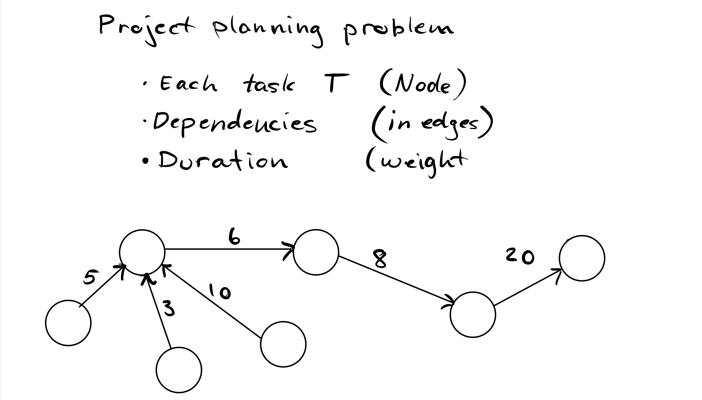
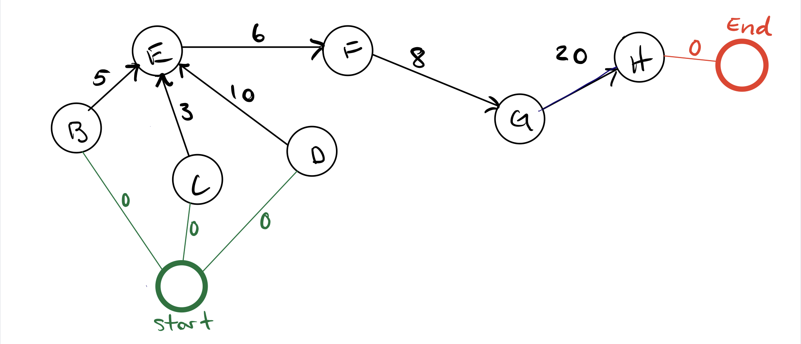
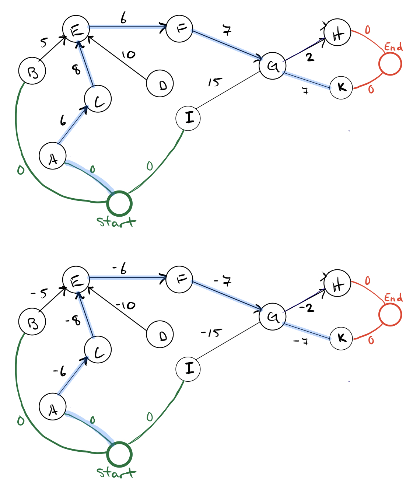
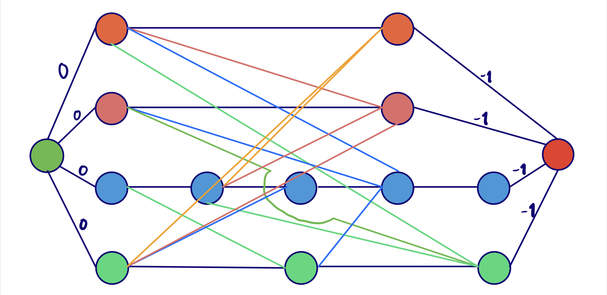
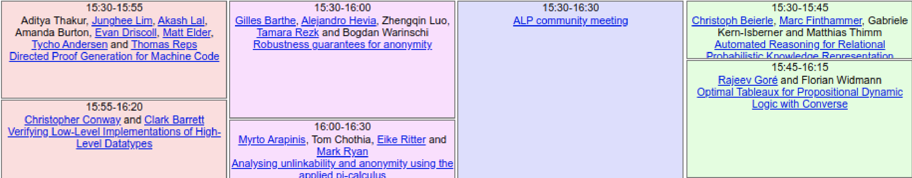

# Problem Module lv3
## General info
* FIRE group number 75
* module number 2
* By
  - Oskar Wallgren, 960107-2292, IT, oskarwallgren@icloud.com
  - Hugo Cliffordson, 970917-5799, IT, cliffords.contact@gmail.com

* "We hereby declare that we have both actively participated in solving every exercise. All solutions are entirely our own work, without having taken part of other solutions.
* Number of hours spent for each one of you
  - Both X
* Number of hours spent in supervision for this module
  - Xh 

## 1. Using Basic Discrete Structures
- Set: unordered collection of items. $\\$ 
When we have several persons signed up for a trip and we need to sort them into rooms according to accomodation preferences.

- Sequence: sequentially ordered collection of items. $\\$ 
  Movies sorted based on genre where one movie can appear under more than one genre
- Tree: branching structure with a root. $\\$ 
  When we have a file system on a computer with a root and several folder connected as children
- Graph: Structure with vertices and edges $\\$
  Social relations with individuals as vertices and their connection as edges
- Directed graph: graph where links are directed (usually represented with arrows) $\\$
  The predator-prey example where the predator is in one end an goes along. 
- Weighted graph: graph with a single number for each edge (can be undirected or directed) $\\$ The tram network in Gothenburg with the stations as vertices and connecting rails as edges.

## 2. Project Planning Problem
We know:
- the duration: how long the task T will take; and
- its dependencies: which tasks must be finished before T can be started.

.

### a) 
We can use a directed graph to model this problem. The first thing we did was to model a graph as the one in the figure above. In this graph the nodes are tasks, the weight of the edges are the time the task takes and the amount of in edges are constraints. The constraints describe that in the tasks that has be completed before moving on to the next task. Here we ran into our first problem. We have no clear representation of where we start and where we end. This problem exists because we might have a graph with many nodes that have zero *in edges* or zero *out edges*. 
We solved this by adding a starting node (task) that connects to all the nodes that have zero in edges with a edge that has weight zero and also an ending node (task) that connects to all the nodes with that has zero out edges with an edge of weight zero.

### b)
Assuming that we got a program that provides a genereic solution to the shortest path problem in a graph, then we can use this to solve the planning problem. We noticed that the shortest path woudl not yield the right answer. Since we were supposed to use the shortest path, we know that we in some way have to manipulate the graph in order to find the solution.

We came to the conclution that if we negate all the edge values we got the right answer in many of the graphs we tried. 

Similar to $a)$ we add a start and an end node to represent starting and finishing the project. Then we negate all edges to the cost. Starting from the *start* node, finding the shortest path to end *end* node and negating the result we can see that we get the right answer. 

This solution can be justified by considering that we are looking for the longest path. This is because we cannot start a task before we finish a task that it is dependent on. And if the task is dependant on many tasks, the time before it can start is equal to the longest time it depends on. We can also be sure that the shortest path of values that are negated will always be the longest path. This justification is enough for us to be satisfied with the model. 

### c) 
Since we know that we can find the shortest path with linear programming, we can assume can that it also can be used together with the logic from $b)$.

The shortest path can be said to be linear because it can follow the typical expression of a linear programing optimization.
We can:
- minimize an objective function.
- subject it to some constraints 
- with the variables to be determined $\ge 0$
  
If we have a directed graph with $n$ nodes. The shortest path will be the minimum "length/weight" of the edges/arcs needed to get from the Start node to the end node. Assuming one unit of flow enters at start and leaves at the end node. 
  

#### Variables
$
{X{({}_{from},_{to}})}
$

This variable describes an edge with start in the node *from* and end in the node *to* as a binary value of being either $0$ or $1$. The $0$ meaning that we do not need it in our shortest path and the $1$ that we need the edge in the shortest path. 

$
{E{({}_{from},_{to}})}
$

This variable describes the value (weight) of the edge that we need to add to our shortest path.

Our objective function is represented by
$$
min\sum^n_{i=1}X_{(from,to)}E_{(from,to)}
$$
It is reasonable that this is our objective function if you consider that X is one in all iterations of the sum, then we will get the sum of all the edges in the graph. If then only the edges in the shortest path has the $X$ value of $1$, then we will get the shortest path. To do this we add the following constraints.
$$
X \ge 0 \\ 
$$
The start node is going to have zero in edges and exactly one out edge, while the end node is going to have exactly one in edge and zero out. We also need a constraint saying that the number of in edges has to be equal to to number of out edges for all other nodes in the shortest path.

When we use this together with negating all the edge values and adding a *start* and *end* node as described in *b)*. Then we will calculate the longest path by a linear programming model. This tells us that we can use a linear programming solver to find the minimum time.

### d)

## 3. Conference Problem
### Using shortest path
Reasonably there are several ways to solve this problem, one way we feel confident will give us the correct answer is using *shortest path*.

If we have all the lectures as vertices and edges with a value of $1$ representing that one lecture is attended. We can use shortest path to find the "longest path" and therefore the maximum number of lectures we can attend. To do this we have to model the data with edges that represent the possible lectures to attend after finishing another lecture. We also add a *start* and *end* node that will represent starting and end of the day. These will be the nodes we want to find the shortest path between.

Let's show this with an example. 

If we model this with a graph where all edges have a value of $-1$ and where there's an edge between all possible ways to walk between lectures we get this graph. We get this (except for a few edges that we choose to exclude from the figure, for better readability):

The green starting node to the left represents a start and the red to the far right represent the end. If we take the shortest path between these and negates the result we are going to get the longest path and therefore the maximum number of lectures that is possible to attend. This can be justified by analizing the longest path, here this will be the path with the largest number of edges.

### Using set packing
In addition to shortest path, we believe that this problem can be solved using set packing. We model the problem according to the definition of set packing linked in the problem module. The objects our case will be the lectures. For better readability we only use the part after the coffee break.

We denote the lectures from left to right $A \rarr D$ and with subsets $A_{1-2}, B_{1-2},C_{1},D_{1-2}$. With the value for each object as $1$. Meaning "one attended lecture". Now we have to subject the object to some constraints, in order to maximize the value of objects chosen. In order to do this, we have to list all the subsets containing objects that are not possible to conbine. The subsets and lectures that are not possible to combine are going to be:
$$
\{A_1,B_1,C_1,D_1\},\\ \{A_1,D_2\}, \\ \{B_1,A_2,D_2\}, \\\{A_2,B_2,C_1,D_2\}, \\ \{B_2,D_2\}
$$
Let's say we want to attend $A_1$. If we look at the subsets we can see that the only object possible to combine with $A_1$ is $B_2$ and $A_2$. This will return the value $2$. Because we choose one of the two subsets. Meaning you have attended two lectures.

Let's list all the possible combinations:
$$
\{A_1,A_2\},\{A_1,B_2\}, \{B_1\},\{C_1\},\{D_1,A_2\},\{D_1,B_2\},\{D_1,B_2\},\{D_1,D_2\}
$$
Here we can see that the largest subsets contains two objects. As all objects have a value of $1$, the set packing algoritm will return $2$.

## 4. $\text{Subset}_{\text{sum}}$ and Partition Problem
