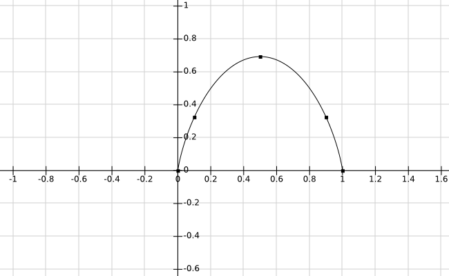

# Problem Module lv4

## General info

- FIRE group number 75
- module number 4
- By

  - Oskar Wallgren, 960107-2292, IT, oskarwallgren@icloud.com
  - Hugo Cliffordson, 970917-5799, IT, cliffords.contact@gmail.com

- "We hereby declare that we have both actively participated in solving every exercise. All solutions are entirely our own work, without having taken part of other solutions.
- Number of hours spent for each one of you
  - Both 12h
- Number of hours spent in supervision for this module
  - 4h

## 1. AMPL MODELLING LANGUAGE

### a)

We have two _set_ which are declarations of an unordered collection of objects. In this example, _FOOD_ is a collection of objects on a menu with a name, cost, and **\_**. _NUTR_ is also a collection of objects specifying nutrition values.

- `param cost {FOOD} >= 0;` says that for all objects in FOOD, the parameter `cost` has to be greater or equal to zero. A menu item cannot have a negative cost.
- `param f_min {FOOD} >= 0 , default 0;` says that for all objects in FOOD, the parameter `f_min` has to be greater or equal to zero and if no value is given, will be set to zero. It is not possible to buy a negative number of items
- `param f_max {j in FOOD} >= f_min[j], default 2;` says that for all objects `j` in FOOD, the parameter `f_max` has to be greater or equal to what `f_min` is for the same object. If the object doesn't have a value for `f_max` it will be set default to two.
- `param n_min {NUTR} >= 0, default 0;` says that for all objects in `NUTR` the parameter `n_min` has to be greater or equal to zero. If no value given, will be set to zero. An object cannot have a negative nutrition value.
- `param n_max {i in NUTR} >= n_min[i], default Infinity;` says that for all objects `i` in NUTR, the parameter `n_max` has to be greater or equal to what `n_min` is for the same object. If the object doesn't have a value for `n_max` it will be set default to infinity. An object's maximum nutrition value must exceed its minimum nutrition value.
- `param amt {NUTR,FOOD} >= 0;`. Here we define a parameter as a matrix with the relationship between FOOD and its nutrition values.
- `var Buy {j in FOOD} integer >= f_min[j], <= f_max[j];` defines an indexed collection of variables `Buy[j]`, each a member of the set `FOOD`. The part `>= f_min` means that all variables `Buy[j]` cannot be assigned a value less than `f_min[j]`. The part `<= f_max[j];` means that each value given to `Buy[j]` may not be larger than `f_max[j]`. These variables are going to be integers in the interval representing how many of the item is bought.
- `minimize Total_Cost: sum {j in FOOD} cost[j] * Buy[j];` is the objective function which minimizes the cost of all the things we want to buy. It's going to loop through all items in `FOOD`, multiply how many is bought with its price and sum them all up to a total cost.
- `subject to Diet {i in NUTR}: n_min[i] <= sum {j in FOOD} amt[i,j] * Buy[j] <= n_max[i];`. The first line `subject to Diet` specifies that this is a constraint with a name `Diet` in this case. After this it says that the constraint is in a form of an indexed collection, therefore one constraint for every item in NUTR. The next part says that the sum of nutrition values for the objects in FOOD that have a value for `Buy[j]` has to be in the interval between `n_min[i]` and `n_max[i]`.
- The constraint `McNuggetsSauces` says that the number of sauces one can buy is limited by how many nuggets one buys. For example, if we get one 20pcs McNuggets we cannot have more than 6 sauces.

### b)

The problem has the same number of variables as there are objects in `FOOD`, 63. This is because we declare one variable every loop through the set. A few different techniques are used when defining constraints. We have 16 constraints describing relation and 63 constraints describing bounds. We see $0 \le \text{C0003} \le 2$ as one constraint.

### c)

We are going to consider two situations. One where we have a many data points and lots of constraints needed. The other with few data points and constraints.

- optimization in standard format
  - For a problem with many data points, these techniques seem very ineffective as we cannot loop to create neither variables or constraints. This means that it will require many lines of code to model it.
  - For a problem with few data points, modelling it with the standard formats _lp_ and _mps_ feels reasonable. LP looks similar to mathematica which we know is effective in simple situations. MPS looks like it required more lines of code than LP as it is column orientet and is therefore less effective to program manually than LP.
- Using AMPL
  - For large data sets AMPL seems like the best choice. That i because we can loop and declare many variables and constraints on just one line of code. AMPL also seems realistic as it looks easy to use existing data from E.g a database to create sets in which you can perform calculations on.
  - Even for a problem with a small amount of data points it seems reasonable to use AMPL. The syntax of AMPL feels similiar to the mathematical notation of optimization problems.

We also feel like it is a good tool to use if you dont know the dimension of the model you are suppose to define. No matter the size of the problem. This is because you can define groups of constraints that really dont care about the model dimensions. We also feel like it would be rather easy to make "big" changes quickly to your model, without much of an effort, which is a good thing.

- Using Mathematica
  - Matimatica us good to use for simpler problem as it is easy to understand and fairly quick to set up. But as it also feels more like a multi purpose tool, it is better to use AMPL specifically for linear programming problems.
- Standard programming (Java, Python)
  - To use native Java feels pretty tedious to use if you want to solve large linear programming problems since there so many options of data structures and techniques that could be used. We found out that it exists a number of libraries that are to be used for linnear programming in Java, but it still feels like alot of code for doing something that, for instance, AMPL could do in one or two lines. The strengths of Java or python could be the individual expertise in either of these programming languages.

## 2. CLIPS EXPERT SYSTEM SHELL

### a)

We find that there are three parts of the program, deffunctions, engine start rules and query rules.

The deffunctions seems like the part running the program. This is where we draw out the questions and collect answers from the user. The answers are then sent to evaluted by the rules.

The engine state rules defines the states we conclude to based on answers from the query rules. These defines satisfactory states and unsatisfactory states.

The query rules defines what questions to ask and how to interpret the answers from the user. These rules are based on yes/no answers and are the core part of the knowledge base. An answer or assertion from one question is then used to decide what question to ask next. The collection of answers from questions results in a conclusion of the engine state.

Last we have the startup and repair rules. The startup rule presents information relevant to the launch of the tool. It for instances prints the welcome message we see when launching. The repair rule prints the information stored in _repair_. The contents of repair is determined by answering the yes or no questions about the engine.

To model knowledge so that a computer can process we need to store the part that acts as the expert in the system it is defined for. Consider all the knowledge a mechanic has about car engines. This information cannot be stored in a database and be used to diagnose the engine with only a computer. The makers of clips solved this problem by using a set of questions with asssertions and consclusions. The program starts with a question, IF it is like this, then do that, else do another thing. For every answer we can make assertions and by these assertions later decide on which question to ask next until we land in a conclusion. In engine/mechanic case, the conclusion is when the system has a "repair" parameter. When we have a repair, skip the rest of the questions and print out the conclusion.

### b)

We think that a system that instead tries to assign probabilities to facts would still have yes or no questions. But instead of making binary assertion we would have to calculate the probability of a fact based on the yes/no answer. The probability of this fact would then have to be saved and used to determine what question to ask next. All questions would also have to take into consideration what the probability of the assertions/conclusions are and then update throughout the question process. At last it prints out all the possible conclusions at their probability.

We wold expect this to be more complicated as probability could change from one question to another. In compasison with binary assertions that keeps it value throughout the process once it's been given a value.

## 3. LIFE EXPECTANCY PROBLEM

### a) Multidimensional linear model

#### i) Would the data be sufficient to fit such a model?

We believe that the data is sufficient to fit a multidimensional linear model because we have data of 1000 deceased poeple and 50 attributes. There will be a few different types of variables. We will have some binary variables, like "has cancer/doesn't have cancer", other variables like length and weight are going to be continuous and also variables harder to define like "type of work", living location and education. We know that each variable is accompaied by a coefficient determining its affect on lifespan. The binary variables are going to be easier to define than the other. But as we have data from 1000 people we belive we will have sufficient data to determine a linear model.

#### ii) Can the least squares method be used?

We believe it is possible to use the least square method to determine a multidimensional model. Imagine that for each attribute it is possible to make a 2-dimensional linear regression. Let's say we do this for all attrubutes and combine them together into a multidomensional model. This works as they all have $y$-variable (life span) in common. We start by trying to define it mathematically.
We will have a vector.

$$
\begin{bmatrix}
    y_1\\y_2\\\vdots\\y_{50}
\end{bmatrix}
=
\begin{bmatrix}
    c \\ c \\ \vdots \\ c
\end{bmatrix}
+
\begin{bmatrix}
    x_{11} \ x_{12} \dots x_{150} \\
     x_{21}\ x_{22} \dots x_{250} \\
      \vdots \\
      x_{501} \ x_{502} \dots x_{5050}\\
\end{bmatrix}
\begin{bmatrix}
    \beta_1 \\ \beta_2 \\ \vdots \\ \beta_{50} \\
\end{bmatrix}
+
\begin{bmatrix}
    \epsilon_1 \\ \epsilon_2 \\ \vdots \\ \epsilon_1 \\
\end{bmatrix}
$$

We then try to minimize the error $min\sum^{50}_{i=1}\epsilon^2_i$. This seems possible but hard to imagine the approximation between points in a dimension this high.

#### iii) How good do you think the model would be?

As we have lots of attributes in consideration it is probably going to be alot better than a guess. What this model lacks is that it doesn't take into consideration how one attribute could affect another. For example, if a person is sick, it is probably going to affect whether or not this person can work out. Reasonably variables will affect eachother and not be linear.

### b) Quadratic model

We feel that a quadratic model for life expectancy should make a better approximation on life expectancy. Because with a quadratic polynomial we can decide if we want vairables to depend on eachother by setting an appropriate coefficient. Let's try this with a 3-dimensional equation; $x_1-x_3$.

$$
f(x_1,x_2,x_3) = ax^2_1 + bx^2_2 + cx^2_3 + dx_1x_2 + ex_1x_3 + fx_2x_3 + gx_1 + hx_2 + ix_3 + j
$$

As we can see in the equation, we can choose to make variables depend on eachother by setting coefficients. Likewise we can set coefficients to zero if we want them to be independent. Let's say that $x_1$ and $x_2$ is daily workout and diabetes. Then we want $d$ to be non-zero because if a person has diabetes, workout can decrease the affect diabetes has on life expectancy.

Another benefit of a quadratic polynomial is that the approximation is going to fit the data points better than a linear approximation. Since we use parabola instead of a tangent line we get a closer approximation beacause the parabola stays closer to the actual function.

We know that the model won't be exact, consider the example of fitting one quadratic function to two different data points we can find an infinite number of functions that can fit the data points exact, with three points we can only find one exact and with more than three, the probability of a function being able to fit exactly radically decreases. As we have 1000 for each attribute, ours is very unlikely to be exact.

### c) Other ways to model

Can we find a better approximation than the ones we have already discussed? As we are working with approximation and therefore a probability we can use a normal distribution model to, in this case a multivariate normal distribution. A multivariate normal distribution is used to approximate any set of correlated real-valued random variables which cluster around a mean value. Reasonably we can find a mean value for each attribute and find a normal distribution. We will have the attributes:

$$
X = (X_1-X_{1000})
$$

Following we will have a mean-vector

$$
\mu = E(X) = (E(X_1), E(X_2), ..., E(X_{1000}))
$$

For each attribute we can also find a standard deviation and thereby model a normal distribution. The only thing we need to consider is if we think that our sample of 1000 deceased people could represent the entire population and make a good approximation. It is a known case that samples from a population can represent a normal distribution that fits reality rather good even though the population might not be normally distributed. One difficulty we encounter is that it is hard to determine whether variables are independent or not.

### d) Machine learning

We have a limited knowledge regarding neural networks and machine learning but reasonably a computer could better analyze the relation between variables. These dependencies are the toughest part for us to model. We believe that if you train an neural network, a computer can become much better in quantifiying this relation compared to a human. A neural network could thereby find patterns that is hard for us and therefore discover a better model. In addition to this, a computer could digest and learn from a larger set of data. When it becomes difficult for us to comprehend big data, the neural network could benefit from it, making the model even better.

## 4. EXPECTED INFORMATION PROBLEM

To find to the formula to $I(p1)$ we start b y defining what we know and what we can calculate.

- Probabilty for a _one_ is $p1$
- Probability for a _zero_ is $1-p1$

We know form previous module that the function for amount of information is $-log(p)$. From this we can deduce the information of a _one_ and the information of a _zero_

- Information from a _one_ is $-log(p1)$
- Information from a _zero_ is $-log(1-p1)$

Now we need the total amount of information from a _ones_ and _zeros_. We know the probability of them. If we have a file with $n$ bits, then the amount of ones is $n*p1$, and the amount of zeros is $n*(1-p1)$. With this we can calculate the total amount of information respectively.

- Total amount information all _ones_ is $n*p1*-log(p1)$
- Total amount information all _zeros_ is $n*(1-p1)*-log(1-p1)$

This means that the avarge information for both ones and zeros will be:

$$
\text{Avarage information} = \frac{\text{information for all ones}+\text{information for all zeros}}{n}
$$

$$
= \frac{(n*p1*-log(p1)+(-log(1-p1)*n*(1-p1)))}{n}=-log(p1)*p1-log(1-p1)*(1-p1)
$$

This gives us the final function

$$
I(p1) = -log(p1)*p1-log(1-p1)*(1-p1)
$$

Plotting the function we get:

With the points $0.0, 0.1, 0.5, 0.9, 1.0$. As we can see the avarage information acquired by the function streches from zero to the maximum value $0.693147$ when $p1=0.5$.

## 5. RESTAURANT PROBLEM
