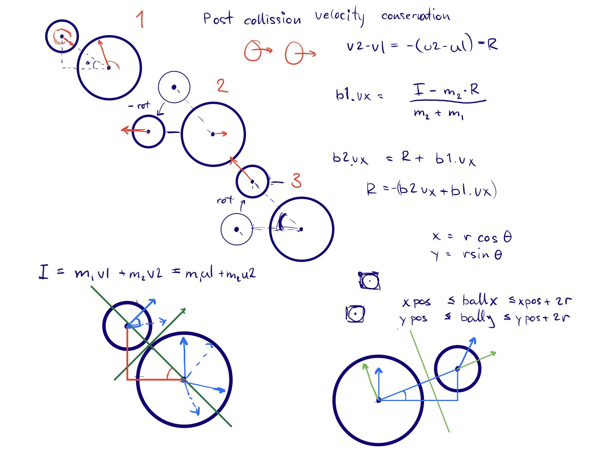

# Reflection 5
## General info

- FIRE group number 75
- module number 5
- By

  - Oskar Wallgren, 960107-2292, IT, oskarwallgren@icloud.com
  - Hugo Cliffordson, 970917-5799, IT, cliffords.contact@gmail.com

- "We hereby declare that we have both actively participated in solving every exercise. All solutions are entirely our own work, without having taken part of other solutions.
- Number of hours spent for each one of you
  - Both 14h
- Number of hours spent in supervision for this module
  - 4h
## WEEKLY MEETING AND DEMONSTRATION
 
### a) Did you have your compulsory weekly meeting with a supervisor?
Yes we met and discussed issues with sticking balls and different ways to solve the issue.
 
### b) Did you demonstrate your code to a supervisor? (If not, please try to do so before submitting your reflection).
Yes we demonstrated it twice for different supervisors.
 
## II. WHAT DID YOU EXPERIENCE AND LEARN?
One thing we learned on this module was how to methodically handle bugs. When we noticed a bug, we did not try to hot fix it by looking for tweaks in the code that could eliminate the bug. Instead, we started analyzing the origin of the bug mathematically and double check our calculations and edge cases. This usually led us to fixing the bug.
 
Another thing we learned that goes hand in hand with the calculations, is the *divide and conquer* technique, where we divided the problem into subproblems. Then we ensured ourselves that we understood the subproblem by drawing figures, an example of this could be the collision of balls. See figure, note that everything in the figure might not be correct, but it gives an idea of how we worked to model the problems. 

 
One bug we encountered was balls sticking together. We first thought that this could be solved by adding an offset to the collision point. But when we started to analyze why it happened, we saw that it wouldn't make a difference based on the mathematics used. This led us to analyze our implementation of the mathematics where we found a small calculation error. This fixed the sticking balls problem.
 
Another issue we encountered is ball picking up energy and heavily increasing in speed. We discussed this issue with a supervisor and learned that it is better to update the $y$-position with the average speed of the speed before gravity and directly after. This solved this issue. Before we added this, our solution was to skip gravity when a collision occurred. 
 
As to the modularity of the program, we started to write the algorithms in place without adding any methods or objects. When we felt confident about the responsibility of the different parts of the code. We divided it into two methods, ``ballCollission()``and ``borderCollission()``. We did the same thing for some functionality in the ball class. This was to avoid confusion and we believe it made our development process better.
 
Comparing our code to the given pseudocode, we can see that we used a conversion between rectangular and polar coordinates but without creating the class ``Point`` to hold the vector. Instead we added the necessary variables to the ball class. Reflecting on it now, it may have been a better solution to adapt the ball class. However, we are satisfied with the simplicity in the outcome of our solution. Comparing how we solved the collision with the example given, we see that the solutions are very similar. This is probably because we took inspiration from Robin's example in the module introductory lecture and discussions with supervisors. 
 
## III. ADDITIONAL QUESTION
 
Similarity between this module and past modules is the way we have learned to approach a problem. Just like for other problems we started to discuss the different components and divide it into subproblems. We also used drawings and figures to visualize our thoughts to each other along the entire process of solving the problem. 
 
One thing that differentiates this module from other modules is how we know our solution is the best one. For past modules we have always tried to disprove our solutions as this gives us a clue of how good it is. For this module, all we had to do was to run the code and visually see what went wrong. Trying different speeds and starting points we could "disprove" our solution just by running it in the editor.
 
Considering that we are not the best programmers of our year, we do not take the detailed code quality into consideration in the self-check. We believe that our strategy and iterations of solving the bouncing balls problem was very good.