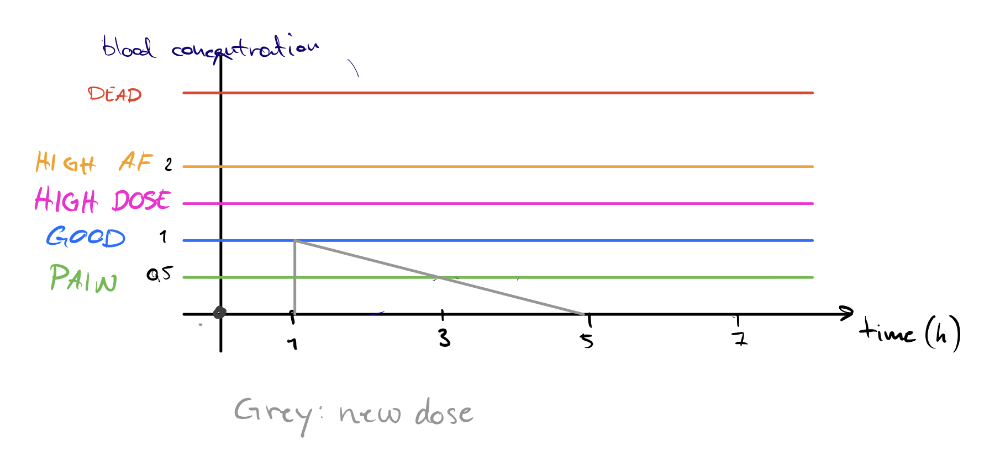

# Problem Module lv6

## General info

- FIRE group number 75
- module number 6
- By

  - Oskar Wallgren, 960107-2292, IT, oskarwallgren@icloud.com
  - Hugo Cliffordson, 970917-5799, IT, cliffords.contact@gmail.com

- "We hereby declare that we have both actively participated in solving every exercise. All solutions are entirely our own work, without having taken part of other solutions.
- Number of hours spent for each one of you
  - Both 12h
- Number of hours spent in supervision for this module
  - 4h

## 1. Whales and Krill Problem
### a)
### b)

We know we have an equilibrium when rate of change is zero, $k' \text{ and } w'= 0$. From the first equation $w'=(-m+nk)w=0$ Directly we can see that there is an equilibrium whem $w=0$. We can also simplify it. 
$$
(-m+nk)w=0 \\
-mw+nkw=0\\
-m+nk=0\\
k=\frac{m}{n}
$$
We see that there is an equilibrium when $k=\frac{m}{n}$. Let's do the same for the other equation $k'=(a-bw)k=0$. Just like the first equation we can see that there is an equilibrium when $k=0$. When we simplify we get:
$$
(a-bw)k=0 \\
ak-bwk=0 \\
a-bw=0 \\
w=\frac{a}{b}
$$
There's another equilibrium when $w=\frac{a}{b}$. 

Now that we have found the equilibrium points we analyze the stablility of each one. We do this by drawing a graph with the two populations in conjunction. Analyzing the first points when $w$ and $k$ are zero and moving along the axes we can see that it moves towards the equilibrium along the $w$-axis and away along the $k$-axis. This means that the equilibrium when $(k=0, w=0)$ is unstable. This is reasonable because considering a non-present whale population, krill population can grow unhindered. It is also reasonable that whale population decreases when there is no krill poopulation present. 

Next, we analyze the equilibrium when $w=\frac{a}{b}$ and $k=\frac{m}{n}$. Here we get that values circle around the equilibrium, we can describe this by giving a description of each numerated point in the graph.
1. This points represents when we have a large whale population and krill population is small. From this points it is going to move towards a point where whale population decreases until there is enough krill again.
2. This point represents when both whale and krill populations are small. Here krill is going to grow as there are few whales stopping the increase.
3. Here we have a large krill population but few whales. The large number of krill are going to stimulate whale population growth and it's going to move towards a larger whale population.
4. Here both whale and krill population is large. But more importantly the whale population has increased to a point where it's going to decelerate the krill population growth.

### c)
With values for the constants we get the equations:
$$
w'=(-0.5+0.000001k)w \\
k'=(0.2-0.0001w)k
$$
The equations for the current value of the population are then going to be
$$
k_{n+1}(t)=k_{n}+tk'_{n} \text{ and } w_{n+1}(t)=k_n+tk'_n 
$$
Simulating this with Euler's method in a table of the values looks like this:
| time | Approx $k$ | Approx $w$ |
|------|----------|----------|
| 0    | 700000   | 3000     |
| 0.3  | 679000   | 3180     |
| 0.6  | 654963   | 3351     |

This means that with starting values $3'000$ whales and $700'000$ krill, results changes to $654'963$ krill and $3'351$ whales after $0.6$ years.
### d)
To start of this analysis we use want to see what it looks like along both axises. $k=20000, w=0$. We can see that the krill population is going to start off at $20'000$ and then take off like shit! The opposite goes for the whales. It's going to start start high and then drop to zero, where it will stay.

Using the same values as in **c)** we get a completely different result. Both the values from $k$ and $w$ are pending from high to low, depending on eachother. We see that when the krill population is reaching its peak, the population of whales increses drastically and affects the krill population to decrease drastically. The same thing happens in reverse when whale population hits its peak. 

Another conclusion we can draw by picking diffrent starting points is that the values start to circle around the equilibrium. If the krill is low and whale is high the values are changing, meaning that krill starts increasing and whales decreasing. This justifies the equlibrium that we found in b. 
### e)
Adding the term $-rk$ gives us the equaiton $k'=(a-bw)k-rk$. Our first interpretation of this is that $r$ has to be a coefficient representing the magnitude of the fishing relative to the current population. Logically the rate of change for $k$ has to do with krill reproduction, the term $-rk$ decelerates the reproduction. To visualize this we try different values for $r$ in mathematica. We start off with the same value for $r$ as for $a$ just to get a better understanding of the effect. We can see that the magnitude of the fishing is greater than the reproduction of krill which results in a heavy deceleration of the population until extinct. This is reasonable because we fish out more krill than is reproduced over the same time period. This also helps justify our model extended with $-rk$. Trying with different values for $r$ we can see that extended fishning results in a longer cycle for both whales and krill. This means that more fishning slows down the positive rate of change for krill and prolongs the time to its peak, which also delays the time for the start of positive increase of whales. 
### f)
We can find a few different ways to improve the model. One thing we noticed is that with the code and starting values given, the whale population can become negative. An improvement to the model is to not allow this. Considering that we analyze the fishing of krill, it is reasonable to also include hunting of whales, as this also affects the populations. Another thing that should be taken into cosideration is that if whales go extinct, krill population moves towards infinity. This is unreasonable as the krill also feeds on something. The population of krill should have a limit.
## 2. Signal Processing Problem
We started by analyzing the diffrent plots with diffrent frequencies. The first thing we noticed was when using low frequencies for both the input function and the output function. For $frequency=200$. We get the two plots below. 

If we analyze theese figures we see that they are almost identical except that they are faceshifted a bit. This does not tell us much, it's likely that this is just the delay between input and output of sound. What's actually intresting is that they are so alike. When inputting low frequencies we get a big similarity between output and input. If we now insted look at the plots when the frequency for both of them are high, we get another interesting result. 

Theese figures above represents the two plots at $frequency = 2000$. From this frequency we can see a much more distinct difference. The amplitude of the output sound is much smaller than for the input sound. From the input sound we can also see that it has spikes instead of rounded tops. From the lower frequencies we noticed that both the input and the output looks a lot like sinus waves, but when we increase the frequency, the input turning points becomes sharp and the whole output plot becomes trunquated. These spikes are a result of having too few samplingpoints for such a high frequency. When this happens the amplitude of the output decreases. 

Since the component would reduce the high frequencies in sound, we think it's reasonable that such a component could be used to remove distorions in sound. That the component is used in variety of ways with the purpose of reducing/removing high frequency buzz and interference from audio. 

If we spoke into the equation we believe that the output would not be as clear as our regular speaking voice. That it would be more flat and harder to interpret. We believe this beacause voice frequency is usually said to be between 300 and 3000 Hz, and with this component we start to reduce the amplitude of sounds much earlier than 3000 Hz. 

## 3. Drug Dosage Problem
To be able to find a model for drog dosage we first need to discuss what happens taking only one dose. It seems reasonable that the blood concentration should follow function with a steep angle upwards and a flatter line going down. This is because the active substance can be released quickly into the system but stays there longer. This is visualized in the graph below:

Let the grey line descrie blood concentration of a substance over time. What the line shows us is dosage which is the magnitude peak and how much the body breaks it down over time. Let's say that this equation is $y=m-\frac{x}{5}$ until $y$ reaches zero. This works as a model for blood concentration of one dose with dosage $m=1$. 

To find a good model we want to find a time schedule where the ideal situation would be to never go above *HIGH DOSE* and never below *PAIN*. To do this we need to add a new dose at a time maximizing time spent within the interval. 
We know that a formula for the optimal dosage is going to look something like: 
$$
D=\text{wanted value}-\text{current value}
$$
The dosage is going to be dependent on what concentration we want to achieve and what the current concentration. The equation for time interval is going to depend on digestion speed. 

We start by breaking it down to if we can find the time interval if the dosage stays the same for all doses. If this is the case, we only need to decide what a reasonable concentraion is. Let's use the same values as in the graph where one dose is $1$. To stay above the *PAIN* level we want to add a dose after 2 hours. The paramaters we have to consider is:-
- time of decay $(r)$
- desired concentration $(c)$
- dosage $(D)$
The time interval $I$ can then be described with the formula:
$$
I = \frac{cr}{D} = \frac{1*4}{1}=4
$$
This says that the time for a dose to decay is 4 hours. But as we want to add a new dose halfway through the dose we divide the answer by $2$. Giving us the equation:
$$
I=\frac{cr}{2D}
$$
This gives us the interval saying that one should take a new dose after 2 hours.

The same formula can be used to find the appropriate dose. This looks like this. 
$$
D=\frac{cr}{2I}
$$
## 4. Socratic Questioning
### a) 
 - *Question:* Have you done a plot of the data points in a graph?
  
 - *Question:* What can we say about the data points? Are they linnear or not?
 - *Question:* Can you guess the form of the function? *Discussion errupts*.
 - *Question:* Based on the form you guessed, can you use the values in the table to define the function more precisely to fit the data? Can it be justified?

### b)
 - *Question:* Have you plotted the function in combination with points? How well does your function fit with all the points?

 - *Qusetion:* What are your functions edge cases? Like when x goes to zero or infinity. Is it reasonable that the data should behave similarly for the problem?
 - *Question:* What other form of functions follows a similar pattern, try plotting!

### c)
- *Question:* What do we know? We start listing the values we know from the question.
  
- *Question:* Is there a relation between these values? Have you tried plotting them?
- *Question:* How do we know that the machine is worth buying? How do we know it's a good investment?
- *Question:* Is there anything else they can do to increase sales? What does the data say?

### d)
- *Question:* What do you think the question is asking for? (This starts a discussion where the group starts talking about the problem, which can lead to them understanding it more without a supervisor telling them anything. A classic *rubber duck* situation).
  
- *Question:* What part of the question are you having trouble with? (We can try to formulate it in another way)
- *Question:* Can we break it down to smaller parts?
- *Situation:* If they give suggestions that are not relevant, try to ask questions that disproves it. If they are on the right track, just let them continue and ask if they feel like they can move on. 