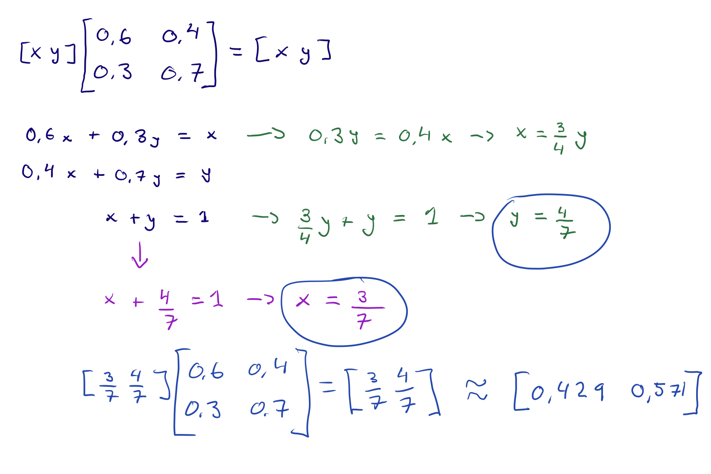

# Problem Module lv7
 
## General info
 
- FIRE group number 75
- module number 7
- By
 
  - Oskar Wallgren, 960107-2292, IT, oskarwallgren@icloud.com
  - Hugo Cliffordson, 970917-5799, IT, cliffords.contact@gmail.com
 
- "We hereby declare that we have both actively participated in solving every exercise. All solutions are entirely our own work, without having taken part of other solutions.
- Number of hours spent for each one of you
  - Both 18h
- Number of hours spent in supervision for this module
  - 5h

## 0. SCHEDULING OF FINAL MEETING
- We are available wednesday October 30th. If possible, we would rather meet morning than afternoon.
## 1. STOCHASTIC TRAFFIC SIMULATION

We know that a determinstic model is a model where the material properties are deterministic and the applied load are determinstic aswell. This means that we can caluculate them exactly, they are not random. In a stochastic model the propoerties are random, i.e they are described with random variables that follow a distribution. The applied load is also random variable. What this means is that a stochastic model has the capacity to handle uncertainty in the inputs built into it. For a determinstic model the uncertainties are external to the model. 

Knowing this we believe that diffrence in the prediction we can draw is that in a stochastic model we can make predictions that are broad and not very specific. We can study the effects of something to understand it better and find relations that might be lost in analytical or numerical treatment. We can make predictions and analyze the predictions performance with a loss function that can desscribe how bad it is to make errors of given size. An example of this is weather forecast, we can draw predictions about tomorrows weather and we can analyze the performance of the prediction, e.g that it has a 70% chance of raining at noon. With deterministic models we can calculate things exactly which means that predictions becomes more of a fact. We could for example draw a prediction about the position of the earth in a astronomical model of planetary motion, but since we could calculate it exactly with the model, the prediction would not vary.
 
## 2.CAR RENTAL PROBLEM
### a)
We have two sites $A$ and $B$. We know that the probability for a car rented at $A$ also left at $A$ is $0.6$. The probability that a car rented at $A$ left at $B$ is $0.4$. Summarized we have these probabilities:
- $A->A=0.6$
- $A->B=0.4$
- $B->B=0.7$
- $B->A=0.3$

From this we can see that we are looking for the probability that we are at one state give that we started at a state. The probability of going towards a state $i$ after being in a state gets us thinking of a markov chain. With this knowledge we can model the transitionmatrix for the probabilties as:
$$
P=
\begin{bmatrix}
    0.6 & 0.4 \\ 0.3 & 0.7
\end{bmatrix}
$$

To calculate the probability of going to state $A$ after n steps given that we started in state $A$ we have the following function:

$$
P(X_n=A | X_0=A) = (P^n)_{AA}
$$
This describes the probability that a single car rented in $A$ is in $A$ after $n$ rentals.
### b)

To find out what proportion of cars will be in $A$ and $B$ after a long time we need find an equlibrium. This means that after a long time the proportion of cars will be the same and we have found a steady state. 

To do this we need to find the probability vector in stable state for our tranistion matrix: 
$$
P=
\begin{bmatrix}
    0.6 & 0.4 \\ 0.3 & 0.7
\end{bmatrix}
$$

We do this by solving: 
$$
\begin{bmatrix}
    X & Y 
\end{bmatrix}*
\begin{bmatrix}
    0.6 & 0.4 \\ 0.3 & 0.7
\end{bmatrix}=
\begin{bmatrix}
    X & Y 
\end{bmatrix}
$$
We know that $X + Y = 1$ so the calculation for the probability vector in stable state will be:

This tells us that we have found the point where the proportion of cars starts to stabalize after a long time. The proportion of cars will be $43\%$  in $A$ and $57\%$ in $B$.

We can control this by checking against our transition matrix after a large number of steps to see the probability of where cars will move depending on state:

$$
P^{1000}=
\begin{bmatrix}
    0.6 & 0.4 \\ 0.3 & 0.7
\end{bmatrix}^{1000}\approx

\begin{bmatrix}
    0.43 & 0.57 \\ 0.43 & 0.57
\end{bmatrix}
$$

This tells us we have found our equlibrium and that the proprtion of cars will be: $43\%$  in $A$ and $57\%$ in $B$ in the long run.

### c)
We cannot find a way to determine the expected number of cars as a function of time with the given model in the first parts. This is because we need a correlation between time and rentals.

There are a number of ways to extend the model and get a solution. 
One way is to define time $t$ as directly correlated to number of rentals $n$: ($t=n$). Let's say we have the variables:
- $I_A$: initial number of cars in $A$.
- $I_B$: initial number of cars in $B$.
- $A_C \text{ and }A_B$ number of cars in $A$ and $B$
$$
\begin{bmatrix}
    I_A & I_B
\end{bmatrix}
\begin{bmatrix}
    0.6 & 0.4 \\ 0.3 & 0.7
\end{bmatrix}^{t} 
= 
\begin{bmatrix}
    A_C & B_C
\end{bmatrix}
$$
Another extension could be to assume an average number of rentals per day $avg_c$. This would give us the model:
$$
\begin{bmatrix}
    I_A & I_B
\end{bmatrix}
\begin{bmatrix}
    0.6 & 0.4 \\ 0.3 & 0.7
\end{bmatrix}^{t*avg_c} 
= 
\begin{bmatrix}
    A_C & B_C
\end{bmatrix}
$$
Both these models does not consider the variation over time in rentals. Reasonably, number of rentals changes for day to day correlated to e.g. vacations etc. This could be described rentals as a function of time, which takes this into consideration $n(t)$.
$$
\begin{bmatrix}
    I_A & I_B
\end{bmatrix}
\begin{bmatrix}
    0.6 & 0.4 \\ 0.3 & 0.7
\end{bmatrix}^{n(t)} 
= 
\begin{bmatrix}
    A_C & B_C
\end{bmatrix}
$$
We could improve this model even further by taking the frequency of rentals from both sites $A$ and $B$ into consideration. This added to the model would look like this:
$$
\begin{bmatrix}
    I_A*f_A(t) & I_B*f_B(t)
\end{bmatrix}
\begin{bmatrix}
    0.6 & 0.4 \\ 0.3 & 0.7
\end{bmatrix}^{n(t)} 
= 
\begin{bmatrix}
    A_C & B_C
\end{bmatrix}
$$

This is important because the site's location could affect the number of rentals made in each of the sites. Imagine that one of the sites is located at the airport and the other at a random place outside of a city. Since the probability of where the car is returned varies between the sites, we need to take the frequency of rentals at a site at a time into consideration. 
## 3. TEXT GENERATION
We approach the problem by selecting a text which will be used as our input. First text we try is a song lyric. We start by testing the text with order 1 and see that the text doesn't make any sense. Letters are all mixed up. One thing we notice is that most words are still possible to pronounce, this is because consonants often are followed by a vowel rather than another consonant. 

When we change the order to 2, we can see that the output text becomes even more readable, even though few "words" are actual words. We have for instance the entire word "guessed" followed by "nobody" which both are medium sized correct words. Most words are still jibberish, but pronoucable. 

Changing to order 3, the text has a majority of real words even though they do not build up complete logical sentences. 

We we have order 4, we start seeing sentences that make sense. We can even see combination of words that are the same as in the input text. 

With order 5, almost every word are actual words, and we see many similarities between the input and output texts. 

We tried this with different types of input texts and different orders. Trying different languages also returns the same result. 

What we learned from observing the different outputs with order 1, is that it didn't make a lot of sense since the algorithm only looks back one letter when determining the next one. However we could se similarities between the outputs using diffrent inputs. The similarities occured with letters that are rarely used. Since they are rarely used the possible letters after this letter are few and this lead to a recognizable pattern. When the program moved to next letter after the rare one, it got confusing right away. This is because the randomized letter with a common letter before has much more possibilities for outputs. 

Increasing the order we follow a pattern of the output text becoming more similar to the input text. This is because increasing the number of letters the alorithm is looking back on, we narrow the probability of what letters can appear next. Meaning, when increasing the order to near the maximum, we can see many sequences that also is found in the input. That is because it not only look back on the previous letters, it utilized the entire matrix for the input text that it creates to see that some sequences are repetetive in the input. This increases the probability of getting the right letter, many times in a row. 

To conclude we can say that to make the output recognizable so that it is similar to the input. It is good the maximize the steps we are looking back so that the probability of getting the right letter next increases. An extension to this could be to add pattern rocognition. This would make it possible the see sequenses of words appearing several times in a text compared to words appearing for the first time. 
## 4
Let's start by defining what we know: We denote a person having the disease with $A$ and a positive test result with $B$. With these variables we set know:
- Probability that a person jas the disease: $P[A]=0.0033$
- Probability that the test shows positive given that a person has the disease $P[A|B]=0.99$
- Probability that a test shows positive given that a person does not have the disease: $P[B|A]=0.03$

Given these probabilities we want to find the probability that a person is sick, given that the test shows positive $P[A|B]$. To find this we can use Bayes' theorem:
$$
P[A|B]=\frac{P[A]*P[B|A]}{P[B]}
$$
First we need to find $P[B]$ which is the probability that a test shows positive. We know this to be the sum of the people having the disease and getting a correct diagnose and all healthy people getting the wrong diagnose. We know that $0.33\%$ of the population have the disease. Out of these, $99\%$ will get the correct diagnose, meaning they will get a positive test diagnose. With this we know that $99.67\%$ of the population is healthy and out of these, $3\%$ will get a positive test result. Given this, we can calculate the probability of getting a positive test result.
$$
P[B]=0.0033*0.99+0.9967*0.03=0.033168
$$
This gives us the equation:
$$
P[A|B]=\frac{P[A]*P[B|A]}{P[B]}=\frac{0.0033*0.99}{0.033168}=0.0985 
$$
The probability of a person having the disease given a positive test result is $9.95\%$.
## 5

## 6
