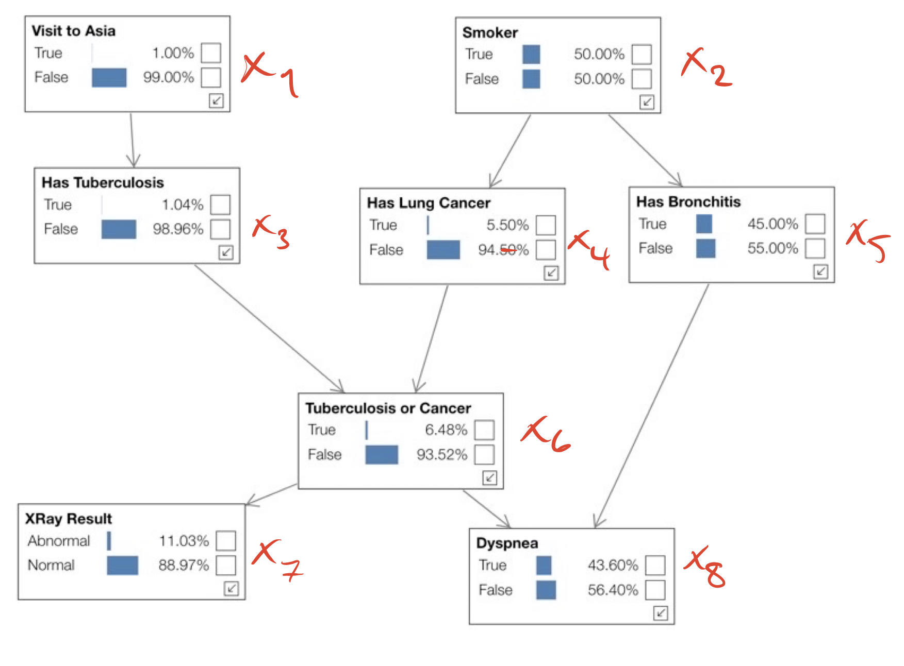

# Reflection module 6

## I. WEEKLY MEETING AND FOLLOW-UP LECTURE

### a) Did you have your compulsory weekly meeting with a supervisor?

Yes, we had several meetings where we discussed bayesian networks. 

### b) Did both of you attend the compulsory follow-up lecture? If you already talked to us about this, please explain.

We attended the follow-up lecture.

### c) If you were asked to talk to a supervisor about the main submission, who did you talk to?

?

## II. WHAT DID YOU EXPERIENCE AND LEARN?
In the stochastic traffic simulation we imporoved our knowledge in determinsric and stochastic models. We discussed the diffrences between the types of model and in what situations you find yourself wanting to use one insted of the other. These discussion lead to depper knowledge about the models which became the foundation for our reasoning in what kind predictions we could draw from them. We then used our answer for the types of predictions and justified it by relating them to real-world problems. 

In the car rental problem we started by analyzing the problem together. We draw figures representing the problem and realized that the problem could be model as a Markov Chain. Once again we were reminded about the strengths in breaking down a problem. This way of working was what lead us to see the problem as a markov chain, wich was key for solving it. With this knowledge we could model the problem to calculate the probability that a Car rented in A is in A aftern $n$ steps.

In the next part of the Car Rental Problem we learnt how to model proportions with probabilities. We discussed the problem and realized that the proportions could be found by finding an equlibrium. This meant that, in the long run, the proportions will remain the same and we have found a steady state. We then improved by justifing our solution by checking our transition matrix after a large number of steps and see that the probabilties for the states where the same as in our solution for the proportions. 

In the last part of the car rental problem we discussed how to model the problem as a function of time given the information we had from the first parts of the problem. We arrived at the conclusion that it was not possible. We then discussed and learn several ways to extend the model to be able to determine the expected number of cars in A and B as a function of time.

In the text generation problem we learnt to approach to problem iterative to make it become an investigation. We started by choosing inputs and analyzing the output with diffrent orders of $k$. We tried to identify patterns in output on the same order of $k$ and then started comparing the ouputs with diffrent orders of $k$. This lead us to understand how the model worked. For instance we could see that even with the lowest level of $k$ we could guess the next letter after a rare letter has been read. We could then justify this by this by reasoning about the high probability of the right carachter when we have read the character $q$ for example. Since not that many characters fit after a $q$, the program where more likey to give the correct letter, but then quickly start to randmoize letters as more common letters were read. We then discussed and reasoned about how the output made more sense the more characters we read dependant on $k$. In this process we learnt how to draw qualitative conclusions based on an investigation that were made without any guidlines. This really justified the quote "the result is where your observations take you" from the probelm description. 

The Medical Test problem was rather easy for us since we had done similar problems recently. In the problem we used Bayes Theory to calculate the probability of a person having the diesese given that the test result showed possitive. One thing we learn was to discuss the answer. The result felt to low at first. That a given a possitve test result it was only about $10\%$ probability that the person actually had the diesese. By discussing we could justify the answer. Since the diesese is so rare, only $0.33\%$ of population, it is more likely that the test tells you that you have it even though you probably dont. 

In the probabilistic expert system probelm we started by studying expert systems and beyesian networks. We then tried the online app Asia and discussed how we thought it worked. After that we used the graph for the Asia system, see figure below, and clearly defined variables for each node. 
 
Again, learning the importance of figures, we used it to help us define the joint probability distribution for the network. We then discussed probelm 4 again and learnt how it could be seen as updating a prior distribution to a posterior distribution. After this we used what we learnt to show how the updated node probabilities $p(x1|observation)..$ can be calculated when an observation is added. We discussed it with eachother and with a supervisor. When we fully understood we started by showing this with a formula in a general form. We then used the formula to show how the updated probability for "Bronchitis" was calculated when the observation "positive X-ray" was given. Lastly, after all we learnt about Bayesian networks, we compared the use of it with an expert system based on production rules. We came to the conclusions that rule based system is best when having clearly defined outcomes like, it rains $\rarr$ bring an umbrella. And that a bayesian network is better adapted for when we cannot make definite assertion. A classic example for this is in health care when making a diagnosis one cannot be entierly sure the diagnosis is correct.

In the last problem we learnt the importance of choosing the right model. We started by analyzing pros and cons by the diffrent models and then draw a conclusion about what model was best to predict the relative frequency of precipitation on May 19. We then reanalyzed the models by adding 95 years worth of more data points. This lead to a discussion about making critical assumptions when choosing a model for a problem. This discussion both helped us choose the right model and realizing when it is important with human judgement in choosing model.

## III. (HOW WELL DID YOU SOLVE THE PROBLEMS?)